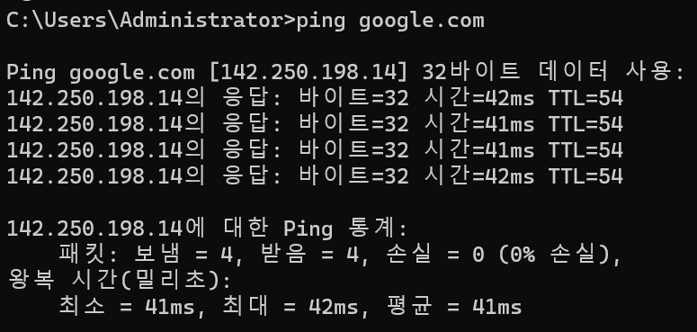
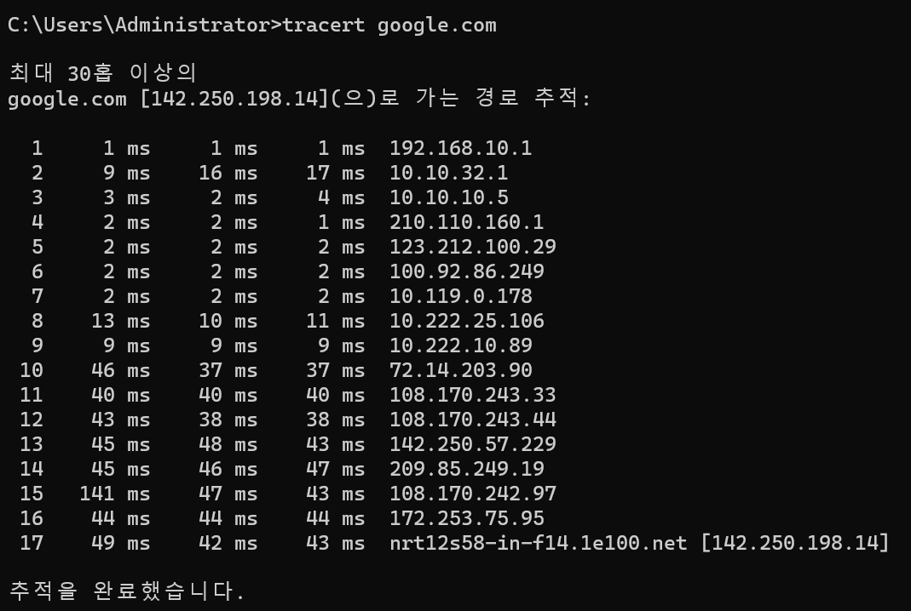

# 2023 동계방학 네트워크 스터디 1주차 과제

-----------------------------

## ping

> ping 명령어는 원하는 IP(혹은 도메인)으로 패킷을 보낸 다음 해당 IP에서 이에대한 응답을 보냈을 때 이를 수신하여 대상 IP의 동작 여부나 네트워크 상태를 파악하는 역할을 하는 명령어라고 할 수 있습니다.
> 먼저 사용 예시로 ping google.com을 입력하면 다음과 같은 결과를 얻을 수 있습니다.

> 구글의 ip 142.250.198.14 로 32바이트 패킷을 보냈을 때 각각 42ms, 41ms, 41ms, 42ms의 속도로 응답을 받은 것을 확인 할 수 있습니다.
> ping 명령어에 –t를 붙여서 사용하게 되면 4회만 수행하는 것이 아닌 Ctrl + C로 멈출 때까지 계속해서 수행합니다. EX) ping google.com –t
> -t말고도 –n이나 –l 과 같은 내용을 붙여서 쓰면 각각 횟수 지정, 패킷의 바이트 지정이 가능합니다.

## ipconfig

> ipconfig는 사용자의 PC에 물리적 혹은 논리적으로 연결된 장치들과 해당 장치에 연결된 IP 주소를 보여줍니다. 대표적으로 사용자의 IP주소나 서브넷마스크, 게이트웨이가 표시됩니다.
> ipconfig도 ping처럼 뒤에 다른 명령어를 붙이면 다른 역할을 추가로 할 수 있습니다. 

> 옵션

+ /all
+ /release
+ /renew
+ /registerdns

> 먼저 /all입니다. 이를 붙여서 실행하게 되면, 일반적인 ipconfig에서 보여주는 정보보다 더 많이 포함하여 보여줍니다. 예를들어 해당 장치의 물리적 주소(MAC)나 DHCP 설정 등을 보여줍니다. 
> 말고도 /release나 /renew, /registerdns 등이 있습니다. 각각 DHCP 구성해제 및 이더넷의 IP 구성 제거, 라우터로부터 새로운 IP주소 및 구성값 불러오기, DNS 이름과 IP주소 등록 초기화의 역할을 수행합니다.

## nslookup

> nslookup의 경우 도메인 네임 서버에 해당 도메인의 정보를 요청하여 조회하는 명령어입니다. nslookup 명령어만 입력해서 cmd에서 실행할 경우, nslookup 프롬프트로 들어가 그 안에서 여러 가지 명령수행이 가능해집니다. 
> EX) nslookup google.com
> -type 옵션을 통해 원하는 내용으로 조회가 가능합니다. EX) -type=txt, -type=all

## route

> route 명령어는 윈도우에서 네트워크 라우팅 테이블을 조작하는 명령어입니다. WSL과 같은 프로그램을 사용하는 경우 가상 랜카드, 유동IP를 가지는 등의 이유로 라우팅 설정이 필요한데 이때 사용이 됩니다.
> route print를 통해 라우팅 테이블을 출력할 수 있습니다.
> route add (Network 대역) mask (서브넷마스크)(게이트웨이)를 통해 새로운 라우팅 항목을 라우팅 테이블에 추가할 수 있습니다. add를 change로 변경하면, 기존 라우팅 항목을 수정할 수 있습니다.
> route delete (Network 대역) 으로 실행하면, 특정 라우팅 항목 삭제가 가능합니다. route –f를 실행하면, 모든 라우팅 테이블 항목을 삭제하고 기본 설정으로 되돌려줍니다.

## tracert

> tracert 명령어는 IP의 세부적인 경로 추적을 할 때 사용합니다. tracert (IP주소)를 입력하여 실행하면, 해당 IP주소로 가는 경로를 다음과 같이 출력해줍니다.

> 옵션

+ -h maximum_hops
+ -d
+ -4
+ -6

> tracert 명령어에 –h maximum_hops 옵션을 통해 30홉이 아닌 다른값으로 설정하여 찾을 수 있습니다.
> -d 옵션을 사용하면 호스트 이름을 사용하지 않게 되면서 더 빠른 추적이 가능합니다. -4, -6옵션은 IPv4, IPv6를 사용하는 옵션입니다.

## netstat

> netstat 명령어는 사용자 컴퓨터의 네트워크 상태를 표시해주는 명령어입니다. 실행하게 되면, 사용한 프로토콜, 로컬 주소, 외부 주소, 상태를 기본적으로 출력해줍니다. 

> 옵션

+ -a
+ -c
+ -l
+ -t
+ -u

> 옵션으로는 –a, -c, -l, -t, -u 등이 있습니다. 각각 모든 연결 및 수신대기 포트 출력, 현재의 명령을 매초마다 실행, 상태가 LISTEN인 포트 출력, TCP로 연결된 포트 출력, UDP로 연결된 포트 출력의 역할을 수행합니다.
> 응용하여 섞어서 사용도 가능합니다.

## nbtstat

> netstat 명령어와 유사하게 생긴 nbtstat 명령어는 NetBIOS over TCP/IP를 사용하여 프로토콜 통계와 현재 TCP/IP 연결을 표시해줍니다. 옵션없이 그대로 실행 시 nbtstat의 설명과 옵션이 출력됩니다.
> 해당 명령어를 사용하여 IP의 충돌이나 같은 IP를 사용하고 있는지의 확인을 할 수 있습니다.

## hostname

> hostname 명령어는 ipconfig 명령어를 통해 찾은 나의 IP를 대체하는 호스트이름을 출력해줍니다. 해당 이름으로 네트워크에서 컴퓨터를 식별합니다.

## netsh

> netsh 명령어는 네트워크 관련 설정을 해주는 유틸리티를 실행하는 명령어로 IP주소 변경이나, DNS 변경 등의 역할을 옵션으로 지정하여 설정할 수 있습니다.
> netstat에서 interface 하위 컨텍스트로 진입하여 IP 설정, DNS 설정등이 가능하고 advfirewall에서 방화벽 정책이나 방화벽 포트 차단 등의 방화벽 관련 세팅또한 가능합니다.

## telnet

> telnet 명령어는 텔넷 서비스를 사용하는 명령어입니다. 텔넷 서비스는 WIN10 기준 기본적으로 비활성화 되어있기 때문에 활성화를 해준 후 사용가능합니다.
> 명령어의 사용은 telnet (텔넷 서버 IP)를 입력하면 로그인 후 텔넷 서비스 사용이 가능합니다.